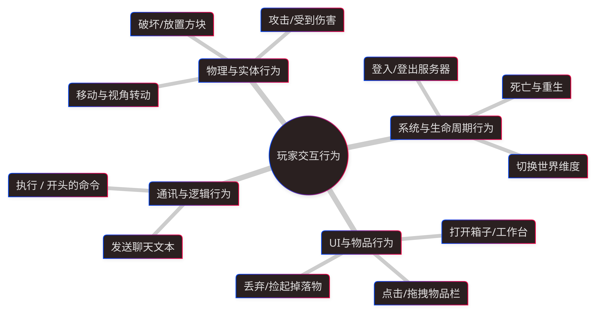
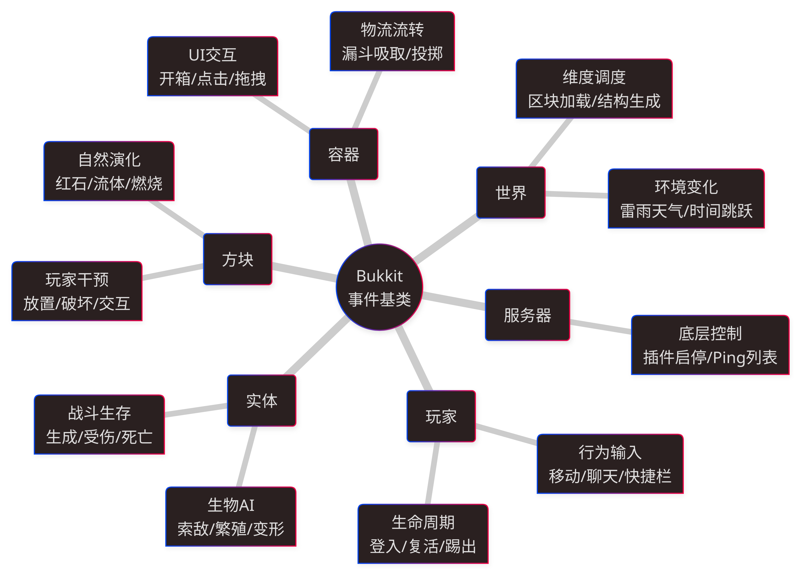
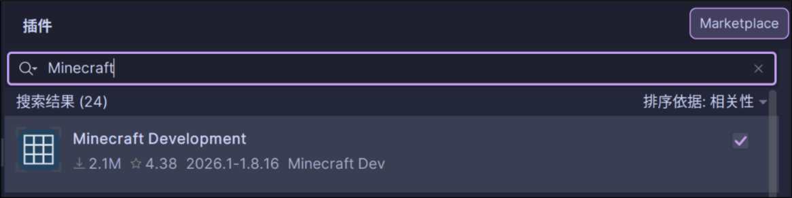

<!-- _class: title-page -->

# Minecraft Paper 服务器和插件开发
### By Kingcq

---

### Paper 服务端是从哪来的？


- <info>Vanilla</info>：Mojang 官方原版，无法加载插件。
- **CraftBukkit**：第一个广泛使用的插件支持
- <success>Spigot</success>：CraftBukkit 的一个分支，提供了更多的 API 和性能优化。
- <danger>Paper</danger>：Spigot 的一个分支，在 API 支持和性能上更进一步。
- <purple>PurPur???</purple>：Paper 的进一步包装，提供更**强劲**的性能。

---

### **插件**相较于<danger>模组</danger>和<success>数据包</success>？

- ##### 为什么选择**插件**？

插件结合了两者对 Minecraft 游戏世界的修改能力，同时将两者拥有的一些缺陷进行了**弥补和隐藏**：

我们从三个角度分别来看一下：

- **编写难度**：是否能快速上手并编写出功能？
- **安装难度**：完成的作品在玩家安装时是否困难？
- **使用效果**：是否能够实现足够多样的功能？

---

### 📁 数据包 (Datapack)

- **编写难度**：<warning>入门极易，精通极其折磨</warning>
  基于 JSON 和原版命令 (mcfunction)。修改合成表、战利品极快。但若要实现复杂的逻辑（如循环、复杂的数学运算），只能依靠记分板和实体，逻辑链路极难维护。
- **安装难度**：<success>完全零门槛（玩家无感）</success>
  纯粹依托于游戏存档/服务端。玩家使用完全纯净的原版客户端即可加入，无需任何额外操作。
- **使用效果**：<danger>局限性强，性能上限低</danger>
  被死死限制在原版命令允许的框架内。无法连接数据库，无法实现多线程处理，高频复杂的命令运行会严重拖垮服务器计算资源 (TPS)。<success>但是它的一些功能可以和插件配合获得更多的可能性</success>。

---

### 🧩 模组 (Mod - Forge/Fabric/NeoForge)

- **编写难度**：<danger>比较困难</danger>
  需要深厚的 Java 功底，掌握 Mixin 字节码注入，并且需要大致理解晦涩的 Minecraft 底层源码（NMS）。要学的东西很多。
- **安装难度**：<danger>门槛较高</danger>
  玩家必须在自己的电脑上安装对应的加载器，并将几十上百个 Mod 文件精确放入客户端文件夹，版本稍微不匹配就会崩溃报错。当然也可以选择整合包一键安装，但这仍然需要一定的操作门槛。
- **使用效果**：<strong>无所不能，没有边界</strong>
  客户端和服务端同时运行。可以彻底重写光影渲染引擎、加入全新的维度世界、全新的按键绑定、完全自定义的 GUI 界面系统。

---

### 🔌 服务器插件 (Plugin)

- **编写难度**：<info>中等偏上 (需要 Java 基础与 API 知识)</info>
  基于高度封装的 Paper/Spigot API，拥有现代编程语言完整的面向对象体验和庞大的开源生态，遇到问题很容易查到现成代码。
- **安装难度**：<success>完全零门槛（玩家无感）</success>
  纯服务端运行，玩家依然使用原版客户端直连。除了需要在服务端安装对应插件以外，无需任何额外操作。这只会对腐竹产生一些麻烦。
- **使用效果**：<success>逻辑控制极强</success>
  可以连接 Redis/MySQL，彻底掌控服务器逻辑。唯一遗憾是 **不能“无中生有”**：无法给客户端注入全新的非原版 3D 渲染模型、按键绑定或全新机制的方块。

---

### 💪 为什么要选择服务器插件？

- **开发难度适中**：不需要掌握复杂的底层技术，只需要掌握 Java 编程语言和 Paper/Spigot API 即可，而 API 这块根本不必担心，因为有详尽的[文档](https://jd.papermc.io/paper/26.1.2/)。
- **用户友好**：玩家根本就不需要操心插件的事情，只要是原版客户端，就能无缝加入服务器。~~*只是需要可怜一下腐竹*~~
- **功能强大**：相较于同样方便的数据包，插件显然有更多的可能性，搭载了 Java 编程体系使得它能够使用所有 Java 生态中的工具和库，能够实现数据持久化、多线程处理、连接数据库、实现复杂的逻辑等等。

---

### 🌏 玩家 & 世界

在正式认识插件之前，我们要先来理解玩家如何与游戏世界交互：



---

### 🌍 实体 & 世界

除了玩家的操作，**实体与实体**、**方块与环境** 每时每刻都在发生着不依赖于玩家的交互。这些交互同样会被服务器捕获，并广播为事件。

想象以下场景：
1. **僵尸看到了村民**并开始追逐。
2. **闪电**击中了一只猪。
3. 悬空的**沙子**受重力影响开始下落。
4. 漏斗将箱子里的**物品吸走**。

---

### 📜 监听万物：Bukkit 事件

这些事件明显可以监听并触发一些额外的逻辑，来实现一些特殊功能



---

### ⏱️ 世界的脉搏：Tick (游戏刻)

Tick 是 Minecraft 游戏世界的“心跳”，每秒执行 20 次。

在一个 tick 中，服务器会处理所有的事件，并更新整个世界的状态：

- <success>处理玩家行为</success>
- <success>实体与 AI 演算</success>
- <success>世界环境更新</success>
- <success>服务器定时任务</success>

如果在这个 <danger>50ms</danger> 的时间窗口内不能完成所有任务，那么服务器就会卡住，表现为 **TPS 下降，玩家操作卡顿**。

---

<!-- _class: title-page -->

# <warning>Paper 插件开发</warning> - **创建插件**

---

### 📦 安装开发环境

要想顺利开发 Paper 插件，我们必须要一个合适的开发环境：

- 我们先要一个[足够强力的 IDE](https://lp.jetbrains.com/intellij-idea-promo/?msclkid=fcc138a0ef46179150cb52a5398cad60&utm_source=bing&utm_medium=cpc&utm_campaign=APAC_en_JP_IDEA_Branded&utm_term=intellij%20IDEA&utm_content=intellij%20idea)（IntelliJ IDEA）
- 还要一个有力气的 IDE 插件：[**Minecraft Development**](https://plugins.jetbrains.com/plugin/8327-minecraft-development)



---

### 🍵 创建插件项目

- 选择新建项目，在生成器中找到 Minecraft，填写必要的信息后就可以成功创建一个 Paper 服务器插件项目了，有两个要注意的点：
  - [Java 包名规范](https://www.cnblogs.com/JavaWebStudyhcz/articles/18969795)
  - [使用魔法](https://ikuuu.win)

其它的注意点不用考虑，因为 IDEA 和 Minecraft Development 插件已经帮你做好了所有的考量

---

<!-- _class: title-page -->

# <warning>Paper 插件开发</warning> - **插件和生命周期**

---

### 🔌 插件主类

当插件项目自动创建完之后，我们就会看到对应的初始代码：

```java
public final class TestPlugin extends JavaPlugin {

    @Override
    public void onEnable() {
        // Plugin startup logic
    }

    @Override
    public void onDisable() {
        // Plugin shutdown logic
    }
}
```
这是插件的核心，所有的插件逻辑都会围绕这个类展开。

---

### 📜 插件的生命周期

插件的生命周期准确说分为三个阶段，而第一个阶段一半很少用到：

- `onLoad()` - 在插件被读取，但还未被加载到服务器时调用
- `onEnable()` - 在插件被加载到服务器时调用
- `onDisable()` - 在插件被卸载时调用

非常朴实无华的生命周期，但却能够包含整个插件的运作过程。

`onLoad()` 生命周期甚至不常用，因为它的作用部分与 `onEnable()` 重叠了

---

<!-- _class: title-page -->

### 示例：在插件的生命周期中向控制台输出一些东西

---

<!-- _class: title-page -->

# <warning>Paper 插件开发</warning> - **事件响应**

---

### ⚡ 语法拆解：事件响应 (Events)

Bukkit 的事件系统采用了典型的**观察者模式 (Observer Pattern)**，辅以 Java 的**反射机制**。

```java
public class MyListener implements Listener {
    @EventHandler
    public void onPlayerJump(PlayerMoveEvent event) { ... }
}
```

- **`implements Listener`**：这是一个**标记接口 (Marker Interface)**（里面没有任何方法）。它的唯一作用是告诉服务器这里面有监听器！
- **`@EventHandler` 注解**：用这个注解来标记监听器方法。
- **参数 `(PlayerMoveEvent event)`**：参数类型决定了你要监听什么事件

---

### ✅ 注册事件监听器

光定义事件监听器还不够，我们还得把它们注册到服务器中：

```java
public final class TestPlugin extends JavaPlugin {
    @Override
    public void onEnable() {
        PluginManager manager = Bukkit.getPluginManager();
        manager.registerEvents(new ExampleListener(), this);

        // ..
    }
}
```

至此，服务器才明白你注册了一个名为 ExampleListener 的监听器，并会在对应的事件发生时调用内部的对应方法。

---

### ⛔ 改变命运：取消事件 (Event Cancellation)

很多时候，我们监听事件是为了**阻止**某件事情的发生。
我们在事件发生前**取消**它，服务器就会当作无事发生：

```java
@EventHandler
public void onBlockBreak(BlockBreakEvent event) {
    Player player = event.getPlayer();

    // 假设：如果玩家不在创造模式，就绝对不允许破坏方块
    if (player.getGameMode() != GameMode.CREATIVE) {
        event.setCancelled(true);
        player.sendRichMessage("<red>抱歉，这是保护区！</red>");
    }
}
```

<success>💡 提示：善用事件取消，你可以轻松实现领地保护、禁止 PvP、禁止吃某种食物等功能，而不需要自己去编写复杂的“复原逻辑”。</success>

---

<!-- _class: title-page -->

### 示例：玩家手持史莱姆块时被攻击免伤并弹飞攻击者

---

### 🤝 进阶技法：动态注册与卸载

默认情况下，我们在 `onEnable` 里注册所有的监听器，在 `plugin.yml` 里写死所有的命令。但这种**静态**方式有两个致命缺陷：
1. **性能浪费**：假设你写了一个只有每周日开启的插件，那么在其它时间，这个插件其实是不需要运行的，白白损耗了内存和时间。
2. **缺乏灵活性**：比如想为某个玩家的特定行为注册监听器，或者又不需要这个监听器了，单纯在 `onEnable` 生命周期中注册显然不够灵活。

这个时候，我们需要动态加载/卸载监听器：

---

### ⚡ 动态卸载事件：HandlerList

动态加载事件很简单，我们刚刚的操作实际上可以在代码的任何一个位置进行，那卸载呢？

Bukkit 的事件系统底层是一个叫做 `HandlerList`（处理者列表）的结构。所有的 `@EventHandler` 最终都被装进了这里。

我们前往[文档](https://jd.papermc.io/paper/26.1.2/org/bukkit/event/HandlerList.html)去观察 `HandlerList`

就会发现，这三个方法的定义是我们实际需要的：

```java
public static void unregisterAll();
public static void unregisterAll(Listener listener);
public static void unregisterAll(Plugin plugin);
```

直接使用 `HandlerList.unregisterAll` 就可以快速卸载事件响应器了

---

<!-- _class: title-page -->

### 示例：铁剑使用右键能够获得抵消三次伤害的机会

---

<!-- _class: title-page -->

# <warning>Paper 插件开发</warning> - **BukkitRunnable**

---

### 🚀 持续生效的效果

在插件开发中，我们经常需要实现一些**持续生效**的效果，比如<warning>坐上火箭，在一段时间内持续向上飞行</warning>

这种长时间的效果显然超出了一个 tick 可以完成的限度，而直接在事件响应中进行阻塞式的行为会直接导致 TPS 爆炸。

因此，我们需要将这个响应的维度从一个 tick 扩展到<success>多个 tick</success>：

```java
BukkitRunnable task = new BukkitRunnable() {
    @Override
    public void run() {
        // Run anything
    }
};
```

---

### 🚀 持续生效的效果

```java
BukkitRunnable task = new BukkitRunnable() {
    @Override
    public void run() {
        // Run anything
    }
};
```
像这样就能创建一个简单的 `BukkitRunnable` 实例，其中的 `run` 方法会在你指定的每个 tick 中执行。

这相当于定义了一个继承 `BukkitRunnable` 的类，这意味着你可以在其中指定变量并在运行过程中记录状态。

---

### 🚀 持续生效的效果

具体运行 `BukkitRunnable` 有如下几种方法：

```java
task.runTask(Plugin plugin);
task.runTaskLater(Plugin plugin, long delay);
task.runTaskTimer(Plugin plugin, long delay, long period);
```

- `runTask`: 直接在下一个 tick 中运行
- `runTaskLater`: 指定的 delay 后运行
- `runTaskTimer`: 指定的 delay 后开始运行，然后每隔 period 运行一次

<warning>如果中途遇到了需要紧急停止的情况，也可以在 `run` 方法中使用 `cancel` 直接取消定时任务</warning>

---

### 🧵 性能红线：主线程与异步任务 (Async Tasks)

在 `BukkitRunnable` 中，除了 `runTask`，你可能还会注意到 `runTaskAsynchronously`。为什么要区分异步？

Minecraft 的所有游戏逻辑（实体移动、方块更新、事件触发）都在**一条主线程 (Main Thread)** 上运行（至少在 <success>paper</success> 中是这样的）。
如果在这个 <danger>50ms (1 Tick)</danger> 窗口内，你执行了以下操作：
- 🌐 发起 HTTP 网络请求下载文件
- 💾 疯狂读写本地大文件
- 🗄️ 连接 MySQL 数据库进行复杂查询

<danger>主线程会被彻底堵死！TPS 瞬间暴跌！</danger>

---

### 🔄 异步与主线程

因此，任何耗时操作必须交给**异步线程**：
<warning>⚠️ 永远、绝对不要在异步线程中修改 Bukkit 的 API 对象（方块、实体、容器等），否则会引发底层并发修改异常而崩溃！</warning>

---

我们需要采用 **“异步获取数据 ➔ 切回主线程修改世界”** 的顺序：

```java
new BukkitRunnable() {
    @Override
    public void run() {
        // 1. [异步线程] 执行耗时操作：去数据库查询玩家的超长信息
        String data = fetchPlayerDataFromDatabase(player.getUniqueId());

        // 2. 耗时操作完成！[切回主线程] 去更新游戏世界
        new BukkitRunnable() {
            @Override
            public void run() {
                player.sendRichMessage("<green>数据加载成功：" + data);
                player.getInventory().addItem(new ItemStack(Material.DIAMOND));
            }
        }.runTask(plugin); // 注意！这里用的是 runTask，回到了主线程
    }
}.runTaskAsynchronously(plugin);
```

---

<!-- _class: title-page -->

### 示例：右键使用烈焰棒，玩家会在5秒内持续向上冲刺

---

<!-- _class: title-page -->

# 中场休息

---

<!-- _class: title-page -->

# <warning>Paper 插件开发</warning> - **命令**

---

### 🪣 Bukkit 中的命令接口

在 `CraftBukkit` 指定的插件加载接口实际非常生硬，它需要你在两个地方注册命令：

`plugin.yaml`
```yaml
# ...
commands:
  mycommand:
    description: "My command"
    usage: "/mycommand"
    permission: "me.kingcq.testplugin.mycommand"
```

---

### 🪣 Bukkit 中的命令接口

在 `CraftBukkit` 指定的插件加载接口实际非常生硬，它需要你在两个地方注册命令：

`TestPlugin.java`
```java
@Override
public void onEnable() {
    PluginCommand myCommand = this.getCommand("mycommand");
    MyCommand commandInstance = new MyCommand();
    if (myCommand != null) {
        myCommand.setExecutor(commandInstance);
        myCommand.setTabCompleter(commandInstance);
    }
}
```

---

### 🪣 Bukkit 中的命令接口

此外，你还需要在 `MyCommand.java` 中实现 `CommandExecutor` 和 `TabCompleter` 接口：

`MyCommand.java`
```java
public class MyCommand implements CommandExecutor, TabCompletor {
    @Override
    public boolean onCommand(
        @NotNull CommandSender sender,
        @NotNull Command command,
        @NotNull String label,
        @NotNull String @NotNull [] args
    ) {
      // onTabComplete 同理…
    }
}
```

---

### 📜 Paper 的命令接口重写

根据[文档](https://docs.papermc.io/paper/dev/command-api/misc/basic-command/)，在 Paper 中，我们可以继承 `BasicCommand` 接口并重写对应方法：

```java
public class MyCommand implements BasicCommand
```

之后，只需要在 `onEnable()` 生命周期中注册这个命令：

```java
@Override
public void onEnable() {
    BasicCommand myCommand = new MyCommand();
    registerCommand("mycommand", myCommand);
}
```

---

### 🔌 需要覆写的接口方法

为了编写一个功能完整的命令，你需要重载这几个方法：

```java
// 必要，决定命令如何运行
public void execute(CommandSourceStack source, String [] args) { ... }
// 非必要，根据当前参数列表给出补全提示
public Collection<String> suggest(
    CommandSourceStack commandSourceStack,
    String[] args
) { ... }
// 非必要，判断命令发出者是否有权限执行命令
public boolean canUse(CommandSender sender) { ... }
// 非必要，与 `canUse` 互斥，指定命令所需权限
public @Nullable String permission() { ... }
```

---

### ⚡ 更简单的命令写法

如果你注意观察，你会发现只有一个方法是必要的

因此，对于一些简单的命令，可以使用更简单的写法：

```java
registerCommand(
    "quickcmd",
    (source, args) -> {
        source.getSender().sendRichMessage("<yellow>Hello!");
    }
);
```

通过一个 `Lambda` 表达式，我们通过定义一个方法来快速创建一个简单命令，而跳过定义一个类来诠释这个命令的全过程

---

<!-- _class: title-page -->

### 示例：使用 /rocket 命令也能触发烈焰棒效果

---

<!-- _class: title-page -->

# <warning>Paper 插件开发</warning> - **物品和容器**

---

### 📦 物品

物品的种类包罗万象：无论是砍树的工具、饱腹的食物、建筑的方块，还是合成的材料，在 Paper 底层，它们都被统一抽象为同一个类：**`ItemStack`**。

一个基础的 `ItemStack` 仅仅包含了“材质 (Material)”和“数量 (Amount)”：

```java
// 创建一个包含 64 个钻石的基础物品堆
ItemStack diamonds = new ItemStack(Material.DIAMOND, 64);
```

但是，要想让物品具有 RPG 属性、特殊的说明或者附魔，我们就需要触及物品的 **“灵魂”** ——`ItemMeta`。

---

### 🪄 赋予物品灵魂：ItemMeta

`ItemMeta` 掌管着物品的显示名称、Lore（物品描述）、附魔等一切视觉和附加数据。
<danger>⚠️ 核心铁律：你必须先将 Meta“抽离”出来，修改完毕后，再将其“注入”回原物品中！</danger>

```java
ItemStack sword = new ItemStack(Material.DIAMOND_SWORD);
ItemMeta meta = sword.getItemMeta();
meta.displayName(
    Component.text("★ 霜之哀伤 ★", TextColor.fromCSSHexString("#00FFFF"))
);
meta.lore(List.of(
    Component.text("冰封王座的遗产", NamedTextColor.LIGHT_PURPLE),
    Component.text("攻击力: +999", NamedTextColor.GOLD)
));
meta.addEnchant(Enchantment.SHARPNESS, 10, true);
```

---

### 💪 添加属性词条

如果说，我想给铲子一个<danger>非常高的攻击伤害</danger>，难道说，我要去算锋利附魔要多少级吗？
当然不用，我们可以直接使用 `AttributeModifier` 来添加自定义属性：

```java
meta.addAttributeModifier(
    Attribute.ATTACK_DAMAGE,
    new AttributeModifier(
        new NamespacedKey("test_plugin", "shovel_attack_damage"),
        1024d, AttributeModifier.Operation.ADD_NUMBER,
        EquipmentSlotGroup.MAINHAND
    )
);
```

---

### 💽 进阶：PersistentDataContainer - 持久化数据容器

**痛点**：如果我们做了一把特殊的剑，在玩家攻击时触发闪电。我们该如何在代码里判断这把剑是不是那把“特殊剑”？
<warning>依赖判断名字（displayName）？绝对不行！玩家可以在铁砧上给普通剑改名来伪造！</warning>

用 `Lore` 是不是可以？如果每种东西的 `Lore` 都不同，那自然是可以的，但这仍然是笨办法，有没有更优美的解法？

有的，兄弟，有的！

---

### 💽 进阶：PersistentDataContainer - 持久化数据容器

**解法**：Paper API 提供了 `PersistentDataContainer`，允许我们在物品内部**隐蔽地存储自定义数据**。

```java
NamespacedKey key = new NamespacedKey("test_plugin", "weapon_id");
meta.editPersistentDataContainer(container -> container.set(
    key,
    PersistentDataType.STRING,
    "lightning_sword"
));
// 在玩家攻击事件中
String weaponId = meta
    .getPersistentDataContainer()
    .get(key, PersistentDataType.STRING);

if ("lightning_sword".equals(weaponId)) { ... }
```

---

### 😕 别的属性？

比如说，我想让铁镐可以被吃下去？或者铁剑可以堆叠64个？

```java
// 变成可食用的食物
item.setData(
        DataComponentTypes.CONSUMABLE,
        Consumable.consumable().consumeSeconds(1.6f).build()
);
item.setData(
        DataComponentTypes.FOOD,
        FoodProperties.food().canAlwaysEat(true).nutrition(100).saturation(100).build()
);

// 变成可堆叠的物品，最大堆叠只能 99
meta.setMaxStackSize(64);
```

更多属性？去查看 [ItemMeta 文档](https://jd.papermc.io/paper/26.1.2/org/bukkit/inventory/meta/ItemMeta.html)！

---

<!-- _class: title-page -->

### 示例：用水瓶创建一个能喝 5 次的治疗药水

---

### 🧰 容器 (Inventory)

容器是用来存放物品的矩阵。在 Minecraft 中，它的作用远不止“储存物品”那么简单，容器扮演着三大核心角色：
1. **储存空间**：玩家背包、箱子、潜影盒，用于数据的持久化存放。
2. **制作站**：工作台、熔炉、酿造台，用于规则性的物品转换。
3. **互动界面 (GUI)**：<success>这是现代服务器插件的绝对核心！</success>通过创建一个不存在于世界上的虚拟箱子，我们能将其作为与玩家进行丰富交互的菜单。

在代码中，容器的尺寸（Size）必须是 **9 的倍数**（例如 9, 18, 27... 最大 54）。

---

### 🖥️ 创建并展示虚拟 GUI 菜单

我们可以随时无中生有地创建一个虚拟容器，并将刚才精心制作的 `ItemStack` 放入其中，最后强行展示给玩家：

```java
// 1. 创建一个 3行 (27格) 的虚拟容器，拥有者设为 null，标题自定义
Inventory gui = Bukkit.createInventory(null, 27, Component.text("服务器核心菜单"));

// 2. 槽位计算 (0-26)
// 第一行是 0~8, 我们把物品放在正中间 (第二行第 4 格，即 13)
gui.setItem(13, sword);

// 3. 打开界面
player.openInventory(gui);
```
<info>此时，玩家的前端界面会被强行打开，并看到这把剑静静躺在中间。</info>

再配合上事件响应，就可以做响应式界面了！

---

<!-- _class: title-page -->

### 示例：简单的响应式界面

---

<!-- _class: title-page -->

# <warning>Paper 插件开发</warning> - **自定义配方**

---

### 🧪 改变生存法则：配方系统 (Recipes)

在 Paper 插件开发中，我们可以通过代码向服务器动态注入几乎所有的原版配方类型。比较常见的有以下几种：

1. **`ShapedRecipe` (有序合成)**：严格要求物品在工作台 3x3 矩阵中的摆放位置（如合成镐子）。
2. **`ShapelessRecipe` (无序合成)**：只要工作台里有这些材料，随便怎么摆都能合成（如合成谜之炖菜）。
3. **`FurnaceRecipe` (熔炉配方)**：将被烧炼物转化为产物（也包括 `BlastingRecipe` 高炉 和 `SmokingRecipe` 烟熏炉）。
4. **`SmithingTransformRecipe` (锻造配方)**：在锻造台中，通过“模板+基底+附加物”升级物品（如钻石升级下界合金）。

---

### 🔑 核心前提：命名空间键 (NamespacedKey)

在注册任何一个配方之前，你必须为其指定一个**全球唯一的身份证**，这就叫 `NamespacedKey`。

由于现在服务器里可能有几百个插件和数据包，如果大家都叫 `my_sword`，服务器就会崩溃。因此，`NamespacedKey` 是由 **“插件名(或命名空间)”** 和 **“配方名”** 两部分组成的。

```java
// 生成一个当前插件专属的 Key： "test_plugin:magic_saddle"
NamespacedKey recipeKey = new NamespacedKey("test_plugin", "magic_saddle");
```

<info>如果有一天你需要取消这个合成配方，也是通过向服务器提供这个 Key 来进行注销（`Bukkit.removeRecipe(recipeKey)`）。</info>

---

### 🧰 语法拆解：创建有序合成 (ShapedRecipe)

```java
NamespacedKey key = new NamespacedKey("test_plugin", "custom_boots");
// 假定这个物品有一些特殊数据
ItemStack result = new ItemStack(Material.IRON_BOOTS);
ShapedRecipe recipe = new ShapedRecipe(key, result);

recipe.shape(
    "   ",
    "F F",
    "I I"
);

recipe.setIngredient('F', Material.FEATHER);
recipe.setIngredient('I', Material.IRON_INGOT);

Bukkit.addRecipe(recipe);
```

---

### 🔥 语法拆解：创建熔炉配方 (FurnaceRecipe)

熔炉配方的注册更加简单直接。你只需要告诉服务器：输入什么、输出什么、给多少经验、需要烧多久？

```java
NamespacedKey key = new NamespacedKey("test_plugin", "flesh_to_leather");

FurnaceRecipe recipe = new FurnaceRecipe(
    key,
    new ItemStack(Material.LEATHER), // 产物：皮革
    Material.ROTTEN_FLESH,           // 原料：腐肉
    1.0f,                            // 经验奖励：1.0点
    200                              // 烧炼时间：200 Tick (10秒)
);

Bukkit.addRecipe(recipe);
```
<success>经典的腐肉烧皮革</success>

---

<!-- _class: title-page -->

### 示例：实现“腐肉烧皮革”功能

---

<!-- _class: title-page -->

# ⏸️ 阶段总结与下期预告

---

### 📚 Part 1 知识点回顾

在今天的讲座中，我们成功让代码接入了 Minecraft 世界：

- ⚙️ **服务端架构**：理解了 Paper 的优势、Tick 机制与世界脉搏。
- 🔌 **插件基石**：掌握了生命周期 (`onEnable`/`onDisable`)。
- ⚡ **事件与调度**：学会了监听万物 (`@EventHandler`)，以及用 `BukkitRunnable` 掌控时间。
- 🪣 **行为注入**：利用 Paper 最新的 `BasicCommand` 快速编写了自定义命令。
- 📦 **物质与规则**：重塑了 `ItemStack`，利用 `ItemMeta` 注入灵魂，搭建了虚拟 GUI 菜单，并篡改了世界的合成法则。

<success>现在，你已经具备了开发中小型 RPG 或生存玩法插件的核心能力！</success>

---

### 🚀 Part 2 下期高能预告

在下一期讲座中，我们将向**更底层的机制**和**更炫酷的视觉体验**进发：

- 🖥️ **现代视觉 UI**：摆脱枯燥的聊天框！掌控 ActionBar、BossBar、发光描边与计分板。
- 💾 **数据持久化**：使用 YAML 配置文件，让你的插件参数可配置、数据不丢失。
- 🗺️ **造物主特权 (硬核)**：拆解 Minecraft 世界生成管线，用代码凭空捏造一个全新的维度世界！
- 🎨 **突破次元壁 (1.21.4+)**：利用材质包，通过 `CustomModelData` 让纯服务端插件也能展示自定义 3D 模型！

**我们下期再见！**

---

<!-- _class: title-page -->

### 感谢各位的聆听！
#### By Kingcq

---

<!-- _class: title-page -->


---

<!-- _class: title-page -->

# <warning>Paper 插件开发</warning> - **视觉 UI**

---

### 🖥️ 告别刷屏：现代化的 UI 视觉反馈

Paper 借助 **Adventure API** 提供了极其优雅的原生 UI 控制：

| UI 类型 | 适用场景与特性 |
| :--- | :--- |
| **ActionBar** | 位于快捷栏上方。适合高频刷新的短信息，不遮挡视野。 |
| **BossBar** | 位于屏幕正上方，带进度条。适合展示全局或小队状态。|
| **Title** | 占据屏幕正中央。适合极其重要的强提醒 |

---

### ⚡ 语法拆解：ActionBar 与 BossBar

- **发送高频动作条 (ActionBar)：**
```java
player.sendActionBar(Component.text("法力值: [||||||||  ] 80/100"));
```

- **创建并展示 BossBar：**
```java
// 创建一个红色、进度为 50%、分成 10 截的 BossBar
BossBar captureBar = BossBar.bossBar(
    Component.text("A 点占领中..."),
    0.5f, BossBar.Color.RED,
    BossBar.Overlay.NOTCHED_10
);
player.showBossBar(captureBar);
```

---

### 📊 Scoreboard (计分板)

Scoreboard 是 Minecraft 中最强大的数据与团队管理系统。它的首要功能是展示右侧的**信息栏 (Sidebar)**。

```java
ScoreboardManager manager = Bukkit.getScoreboardManager();
Scoreboard board = manager.getNewScoreboard();
Objective obj = board.registerNewObjective(
    "game_stats",
    "dummy",
    Component.text("★ 战区数据 ★")
);
obj.setDisplaySlot(DisplaySlot.SIDEBAR); // 显示在屏幕右侧
obj.getScore("当前击杀:").setScore(5);
obj.getScore("剩余存活:").setScore(12);
player.setScoreboard(board);
```

---

### ⚔️ Team (队伍系统)

计分板不仅仅能显示侧边栏，它里面还包含着一个极其强大的子系统：**队伍 (Team)**。

```java
// 在刚才的 board 中注册一个“红队”
Team redTeam = board.registerNewTeam("Red");

// 设置队伍前缀与颜色
redTeam.prefix(Component.text("[红队] ", NamedTextColor.RED));
redTeam.color(NamedTextColor.RED);

// 开启队伍友伤豁免
redTeam.setAllowFriendlyFire(false);

// 将玩家加入红队 (注意参数传的是玩家的名字字符串)
redTeam.addEntry(player.getName());
```

---

### 🥷 隐身与发光：修改玩家的头顶名字

队伍系统掌管着玩家**头顶名字 (NameTag)** 的渲染规则。掌握它，你就能做出硬核的潜行游戏。

**需求 1：隐藏头顶名字**
```java
redTeam.setOption(Team.Option.NAME_TAG_VISIBILITY, Team.OptionStatus.NEVER);
```

**需求 2：透视发光描边**
```java
// 只要刚才设置了 redTeam.color(NamedTextColor.RED);
// 当我们赋予玩家发光属性时，客户端渲染出来的轮廓线就会变成红色
player.setGlowing(true);
```

---

<!-- _class: title-page -->

### 示例：试一下刚才提到的一些功能？

---

<!-- _class: title-page -->

# <warning>Paper 插件开发</warning> - **配置文件的加载/保存**

---

### 📚 Yaml

`YAML` 是一种类似 `JSON` 的结构化数据格式，可以表示多层次多类型的复杂结构化数据：

```yaml
players:
  -
    name: "kingcq"
    age: 22
    tags: ["student", "developer"]
    op: true
  -
    name: "stridebeach",
    age: 21
    tags: ["strange", "hyw"]
    op: false
```

---

### 📃 配置文件

Paper 服务器插件的配置文件就推荐使用 `YAML` 格式编写，并提供了丰富的[语法支持](https://jd.papermc.io/paper/26.1.2/org/bukkit/configuration/file/YamlConfiguration.html)：

```java
@Override
public void onEnable() {
    File file = new File(getDataFolder(), "myconfig.yml");
    YamlConfiguration myconfig = YamlConfiguration.loadConfiguration(file);
}
```

而想要获取到配置文件中的内容，比如说我要获得 `players` 中第一个人的 `name`，只需要：

```java
String name = myconfig.getString("players.0.name");
```

---

### 📃 配置文件的读取

`YamlConfiguration` 提供了[充足的接口](https://jd.papermc.io/paper/26.1.2/org/bukkit/configuration/MemorySection.html)用来获取配置文件中的数据。

而对于其中的 `path` 参数，想必你也能猜到，它实际上是一个 `String` 类型的路径，用来指定配置文件中的具体位置：

```java
String name = myconfig.getString("players.0.name");
String age = myconfig.getString("players.0.age");
List<String> tags = myconfig.getStringList("players.0.tags");
boolean op = myconfig.getBoolean("players.0.op");
```

特别地，你可以使用 `getConfigSection()` 来继续拆分 `YAML` 文件：

```java
ConfigurationSection section = myconfig.getConfigurationSection("players.0");
section.getString("name");
```

---

### 📃 配置文件的保存

`YamlConfiguration` 提供了 `save()` 方法来保存配置文件：

```java
myconfig.save(new File(getDataFolder(), "myconfig.yml"));
```

那对于其中具体的数据，如何修改呢？

YamlConfiguration 提供了 `set()` 方法，可以将指定的 `path` 字段的内容修改为任何支持的类型：

```java
myconfig.set("players.0.name", "aintcecily");
myconfig.set("players.1.age", -1);
```

特别地，如果后面要设置的值为 `null`，这条字段会直接被删除。

---

### ⚠️ 性能陷阱：主线程与磁盘 I/O

你应当也注意到了，读写配置文件一定是对**整个文件**进行操作，在配置文件比较大的情况下，这意味着<danger>大量的磁盘读写开销</danger>。

因此，为了尽可能避免大量的开销，我们最好只在 `onEnable` 和 `onDisable` 生命周期中读取和保存配置文件。

当然，你也可以选择 `懒加载` 的思路，当需要配置文件的时候再去加载，但 <warning>在整个插件生命周期中只加载一次</warning>。

> 担心服务器被强制 kill 了，配置文件没来得及保存？

~~*除了定时保存配置文件以外，这种情况确实没招，受着*~~

---

<!-- _class: title-page -->

### 示例：支持在配置文件中调整上升速度和时长

---

<!-- _class: title-page -->

# 中场休息

---

<!-- _class: title-page -->

# <warning>Paper 插件开发</warning> - **世界生成**

---

### 🗺️ 拆解造物引擎：Chunk 生成管线

哪怕是原版的 Minecraft，生成一个 Chunk（16x16x384的区块）也要经历极其严密且复杂的流水线加工。在 Bukkit API 的 ChunkGenerator 中，这条流水线被完美地暴露给了我们：


我们可以选择性的调整其中的任何一个步骤来影响世界生成。

---

### 🌏 注册生成器

为了让服务器知道我们的插件有生成器，以及如何获取它，我们可以在 Plugin 主类中重写 `getDefaultWorldGenerator()` 方法：

```java
@Override
public ChunkGenerator getDefaultWorldGenerator(String worldName, String id) {
    return new MyCustomGenerator();
}
```

同时，根据 [Bukkit 配置文档](https://docs.papermc.io/paper/reference/bukkit-configuration/)，我们需要在 `bukkit.yml` 中指定接管世界生成的插件，使用插件配置中的 `name` 来定位插件：

```yaml
worlds:
  world:
    generator: TestPlugin
```

---

### 🌏 动态生成世界

如果你不想破坏原版主世界，而是想利用代码 **“凭空创造一个全新的副世界或游戏房间”**，可以使用 Bukkit 提供的 `WorldCreator API`：

```java
WorldCreator creator = new WorldCreator("alien_dimension");

creator.generator(new MyCustomGenerator());
creator.generateStructures(false);
creator.biomeProvider(new MyBiomeProvider());

World alienWorld = Bukkit.createWorld(creator);
```

---

### ❌ 删除世界？

直接删除世界显然是不可取的，因为<warning>世界正在被服务器占用</warning>！

要彻底抹除一个世界，我们必须执行严密的**两步销毁**：
1. **清场与内存卸载 (Unload)**：斩断服务器对该世界的一切资源引用。
2. **物理毁灭 (File I/O)**：利用 Java 底层文件操作，擦除硬盘痕迹。

核心方法是 `Bukkit.unloadWorld()`，不过请注意[文档](https://jd.papermc.io/paper/26.1.2/org/bukkit/Bukkit.html#unloadWorld(java.lang.String,boolean))：

文档中提示我们不能在世界正在 tick 的情况下卸载它：

---

### 😲 我草，那咋办？

“一个 Tick”并不等同于“世界正在 Tick”。Minecraft 服务端在一个 50ms 的 Tick 生命周期里，是严格分阶段（Phases）执行的：

1. 📥 **网络封包处理阶段**
2. ⚙️ **Bukkit 调度器任务执行阶段 (`runTask`) 👈 <info>我们的代码在这里！</info>**
3. 🌍 **世界 Tick 阶段 (`isTickingWorlds = true`) 👈 <danger>事件在这里触发！</danger>**
4. 📤 **数据同步与发包阶段**

所以，目标其实很简单，我们使用一个 `BukkitRunnable` 来包装一下就可以了。

---

### ❌ 删除世界？

```java
World toDelete = Bukkit.getWorld("nether");
    if (toDelete != null) {
        BukkitRunnable task = new BukkitRunnable() {
            @Override
            public void run() {
                for (Player player : toDelete.getPlayers()) {
                    player.teleport(player.getRespawnLocation());
                }
                for (Chunk chunk : toDelete.getLoadedChunks()) {
                    chunk.unload(false);
                }
                Bukkit.unloadWorld(toDelete, false);
            }
        };
        task.runTask(TestPlugin.plugin);
    }
}
```

---

### ❌ 删除世界？

然后从物理层面删除世界，别忘了留足 unload 世界的耗时：

```java
BukkitRunnable deleteTask = new BukkitRunnable() {
    @Override
    public void run() {
        File worldFolder = new File(
            Bukkit.getWorldContainer(), toDelete.getName()
        );
        deleteWorldFolder(worldFolder);
    }
};
deleteTask.runTaskLater(this, 2L);
```

---

### ❌ 删除世界？

至于 `deleteWorldFolder`，顺手的事：

```java
public void deleteWorldFolder(@NotNull File path) {
    if (path.exists()) {
        File[] files = path.listFiles();
        if (files != null) {
            for (File file : files) {
                if (file.isDirectory()) {
                    deleteWorldFolder(file);
                } else {
                    file.delete();
                }
            }
        }
        path.delete();
    }
}
```

---

### 🌡️ 第一步：群系分布 (BiomeProvider)

**一切的前提是群系。** 它是冷还是热？是沙漠还是平原？这决定了后续表皮铺什么方块、下不下雪。

在 `ChunkGenerator` 中重写对应方法，根据信息返回群系：

```java
public class MyBiomeProvider extends BiomeProvider {
    @Override
    public Biome getBiome(WorldInfo worldInfo, int x, int y, int z) {
        return Biome.LUSH_CAVES;
    }

    @Override
    public List<Biome> getBiomes(WorldInfo worldInfo) {
        return List.of(Biome.LUSH_CAVES);
    }
}
```

---

### 🏔️ 第二步：噪音地形生成 (generateNoise)

有了群系，接下来是**搭骨架**。这一步只负责确定哪些地方是实心的，哪些地方是空的。
<info>注意：X 和 Z 是局部坐标 (0~15)，Y 是绝对坐标！</info>

```java
@Override
public void generateNoise(
    WorldInfo worldInfo, Random random,
    int chunkX, int chunkZ, ChunkData chunkData
) {
    for (int x = 0; x < 16; ++x) {
        for (int z = 0; z < 16; ++z) {
            for (int y = chunkData.getMinHeight(); y < Math.min(60, chunkData.getMaxHeight()); ++y) {
                chunkData.setBlock(x, y, z, Material.STONE);
            }
        }
    }
}
```

---

### 🏜️ 第三步：地表覆盖 (generateSurface)

骨架搭好了，全是灰扑扑的石头。现在我们要**上色**。
这一步通常结合第一步的群系。

```java
@Override
public void generateSurface(
  WorldInfo worldInfo, Random random, int chunkX, int chunkZ, ChunkData chunkData
) {
    // 我们在这个阶段寻找最顶层的石头，并把它替换成我们想要的表面
    for (int x = 0; x < 16; x++) {
        for (int z = 0; z < 16; z++) {
            chunkData.setBlock(x, 60, z, Material.MAGMA_BLOCK);
            chunkData.setBlock(x, 59, z, Material.NETHERRACK);
        }
    }
}
```

---

### 🪨 第四步与第五步：基岩与洞穴

这两步分别处理世界的 **“托底”** 和 **“内部镂空”**。

*(在现代开发中，如果我们不想自己写复杂的洞穴雕刻算法，可以直接 `return` 交给原版的生成器处理！)*

```java
@Override
public void generateBedrock(
  WorldInfo worldInfo, Random random, int chunkX, int chunkZ, ChunkData chunkData
) {
    for (int x = 0; x < 16; x++) {
        for (int z = 0; z < 16; z++) {
            chunkData.setBlock(x, worldInfo.getMinHeight(), z, Material.BEDROCK);
        }
    }
}
```

---

### 🌲 第六步：自然装饰物 (BlockPopulators)

整体框架完成了，剩下的任务就是点缀了。在 `getDefaultPopulators` 里返回各种装饰器，用来种树、撒矿石、长杂草。
<danger>注意：Populator 阶段使用的是世界绝对坐标！</danger>

```java
public class OrePopulator extends BlockPopulator {
    @Override
    public void populate(
        WorldInfo worldInfo, Random random, int chunkX, int chunkZ, LimitedRegion region
    ) {
        int worldX = (chunkX << 4) + random.nextInt(16);
        int worldZ = (chunkZ << 4) + random.nextInt(16);
        int y = 50;

        if (region.getType(worldX, y, worldZ) == Material.STONE) {
            region.setType(worldX, y, worldZ, Material.DIAMOND_ORE);
        }
    }
}
```

---

## 🏰 第七步：生成自定义建筑结构 (Structures)

在游戏中用原版的“结构方块 (Structure Block)”保存一个 `.nbt` 建筑模型文件，然后在 Populator 阶段，使用 Bukkit 的 `StructureManager` 强行将这个建筑“粘贴”到世界上！

```java
@Override
public void populate(
    WorldInfo worldInfo, Random random, int chunkX, int chunkZ, LimitedRegion region
) {
    if (random.nextDouble() < 0.01) {
        // 1. 加载我们在 resources 文件夹里放好的 nbt 结构文件
        NamespacedKey key = new NamespacedKey("test_plugin", "player_house");
        Structure structure = Bukkit.getStructureManager().getStructure(key);

        // 2. 将建筑强行粘贴到指定坐标 (世界绝对坐标)
        Location loc = new Location(null, chunkX << 4, 61, chunkZ << 4);
        structure.place(region, loc, false, StructureRotation.NONE, Mirror.NONE, 0, 1.0f, random);
    }
}
```

---

### 🏠 `.nbt` 文件到底放哪？

如果采用“内部打包”的方案，我们不能直接使用 `getStructure(key)`（它默认去 world 文件夹里找）。我们需要用 Java 经典的 `InputStream`（输入流）技术，直接从插件的 `.jar` 压缩包内把文件“抽”出来：

```java
Structure myStructure;

try {
    InputStream stream = plugin.getResource("structures/player_house.nbt");
    myStructure = Bukkit.getStructureManager().loadStructure(stream);

} catch (Exception e) {
    plugin.getLogger().severe("无法加载结构文件！");
}
```

---

<!-- _class: title-page -->

# 示例：创建一个简单的平坦世界

---

<!-- _class: title-page -->

# 🎨 客户端视觉掌控
### 动态材质包与字符串模型数据 (1.21.4+)

---

### 🚧 自定义物品贴图

<danger>无论你的 Java 代码写得多么逆天，纯粹的服务端插件是绝对不可能凭空把一张全新的 `.png` 物品贴图塞进玩家客户端内存里的！</danger>

Minecraft 是 C/S（客户端/服务端）架构。服务器只能告诉客户端：“玩家手里拿的是一根木棍 (Stick)”。至于这根木棍长什么样，完全由客户端本地的文件决定。

**✨ 破局之法：**
让服务器向玩家发送一个 [资源包 (Resource Pack)](https://zh.minecraft.wiki/w/Tutorial:%E5%88%B6%E4%BD%9C%E8%B5%84%E6%BA%90%E5%8C%85) 的下载链接。客户端下载后，就会用包里的新图片来渲染游戏画面！

---

### 📁 材质包基础：骨架与灵魂

材质包本质上是一个具有严格目录结构的 `.zip` 压缩包。
首先，我们需要在根目录建立 `pack.mcmeta`（材质包的身份证）：
下面这段 JSON 是通用的，可以适用于任何版本的材质包，但考虑到之后用到的语法比较新，Minecraft 版本最好还是在 `1.21.4+` 为好。

```json
{
  "pack": {
    "description": "Auto-generated resource pack for TestPlugin",
    "pack_format": 9999,
    "supported_formats": [0, 9999],
    "min_format": 0,
    "max_format": 9999
  }
}

```

---

## 🏷️ CustomModelData

在 **Paper 1.21.4+** 引入了数据组件之后，我们终于可以在 `CustomModelData` 中使用**语义化的字符串**了！

```java
ItemStack magicWand = new ItemStack(Material.STICK);
ItemMeta meta = magicWand.getItemMeta();
meta.displayName(Component.text("★ 火花法杖 ★"));
meta.setItemModel(new NamespacedKey("test_plugin", "flame_wand"))

CustomModelDataComponent cmd = meta.getCustomModelDataComponent();

cmd.setStrings(List.of("test_plugin:flame_wand"));

meta.setCustomModelDataComponent(cmd);
magicWand.setItemMeta(meta);
```

---

### 📁 现代材质包：1.21.4+

有了字符串暗号，我们要教客户端怎么认出它。一个现代的材质包 `.zip` 结构如下：

```text
my_resource_pack/
├── assets
│   └── test_plugin
│       ├── items
│       │   └── copper_sword.json
│       ├── models
│       │   ├── blade_1.json
│       │   ├── hilt_1.json
│       └── textures
│           └── item
│               ├── copper_blade.png
│               └── copper_hilt.png
└── pack.mcmeta
```

---

### 📝 JSON：[物品模型映射](https://zh.minecraft.wiki/w/%E7%89%A9%E5%93%81%E6%A8%A1%E5%9E%8B%E6%98%A0%E5%B0%84)

```json
{
    "model": {
        "type": "composite",
        "models": [
            {
                "type": "select",
                "property": "custom_model_data",
                "index": 0,
                "fallback": {
                    "type": "empty"
                },
                "cases": [
                    {
                        "when": "copper",
                        "model": {
                            "type": "model",
                            "model": "test_plugin:hilt_1"
                        }
                    },
                ]
            },
        ]
    }
}
```

---

## 🌐 动态托管：插件内置 Web 服务器

材质包做好了，怎么发给玩家？
我们可以利用 Java 自带的 `HttpServer`，将资源包托管到某个端口：

```java
HttpServer server = HttpServer.create(new InetSocketAddress(8080), 0);

server.createContext("/pack.zip", exchange -> {
    byte[] packData = Files.readAllBytes(Paths.get("plugins/AwesomePlugin/pack.zip"));

    exchange.sendResponseHeaders(200, packData.length);
    exchange.getResponseBody().write(packData);
    exchange.getResponseBody().close();
});

server.start();
```
之后通过 [Paper API](https://jd.papermc.io/paper/26.1.2/org/bukkit/entity/Player.html#addResourcePack(java.util.UUID,java.lang.String,byte[],java.lang.String,boolean)) 请求玩家下载资源包就可以了

---

<!-- _class: title-page -->

# 示例：创建一个自定义剑模型映射

---

<!-- _class: title-page -->

### 感谢各位的聆听！
#### By Kingcq
